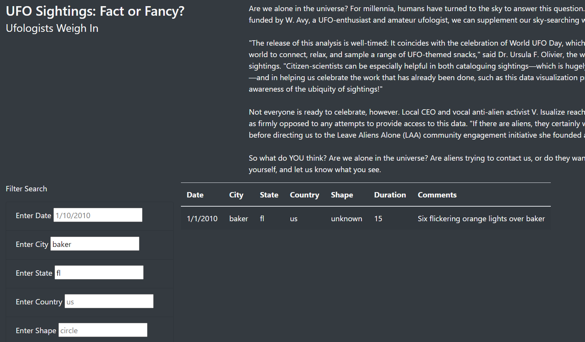

# UFOs

## Overview
This project involved building a function that allows users to filter for multiple criteria in our UFO sightings webpage. Filters for the city, state, country, and shape of the UFO sighted were added. 

## Results
In order to filter the webpage, users will enter the appropriate search criteria in its respective search bar. After clicking out of the search bar, the webpage will automatically select the data entered and filter it to only include what was searched for. In the screenshot below, we can see that after searching for the city of 'baker' in the state of 'fl', we were able to narrow our search. To reset our search, we need only to click the "UFO Sightings" button on the top left of the webpage.

## Summary 
A current drawback of this webpage is that we do not have a designated button for refreshing our search. Although we can just refresh the page in other ways, it would be more professional and look cleaner if there was a clear filter button. Also, a button to activate the search might be more preferable. Another recommendation for development would be to add the ability to search for multiple criteria under the same filter. For example, if you wanted to search for a sighting on multiple states, you could not with the current build.
